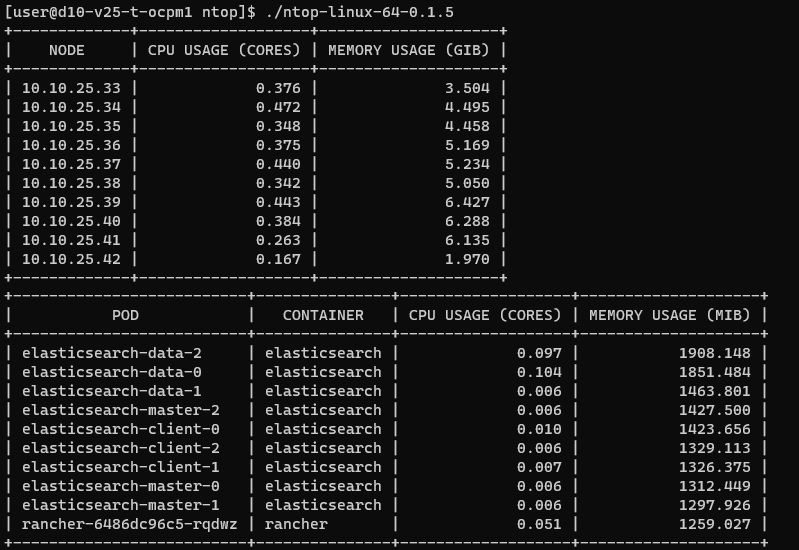

# Kubernetes Node & Pod Metrics Tool


ntop is an open source tool that allows you to visually and clearly see the status of all your nodes on Kubernetes with kubectl.

This tool fetches and displays the CPU and memory utilization metrics of Kubernetes nodes and pods. It leverages Kubernetes' metrics server to retrieve data and provides a command-line interface for easy consumption. The data is tabulated for clarity using the `tablewriter` package.

   


## Table of Contents
1. [Installation](#installation)
2. [Usage](#usage)
3. [Features](#features)
4. [Development](#development)
5. [Roadmap](#roadmap)
6. [License](#license)

## Installation

### Prerequisites:

- `Go` (1.16 or later)
- Access to a Kubernetes cluster
- Kubernetes configuration file (usually found at `~/.kube/config`)

### Build:

Clone the repository to your local machine:

```
git clone https://github.com/canberkdmn/ntop
```

Navigate to the project directory:

```
cd ntop
```

Build the tool:

```
GOOS=linux GOARCH=amd64 CGO_ENABLED=0 go build -o ntop-linux-64-0.1.6
```

## Usage

Before running ntop, you should install metrics-server on your cluster 

Installing metrics server: 

``` 
kubectl apply -f https://github.com/kubernetes-sigs/metrics-server/releases/latest/download/components.yaml
```

NOTE: If you got SSL/TLS Error, you should use --kubelet-insecure-tls flag inside components.yaml 


After building the project, you can run the tool:

```
./ntop-linux-64-0.1.6 --kubeconfig=path/to/your/kubeconfig
```

By default, the tool will order the pod listings by memory usage. If you want to order by CPU usage:

```
./ntop-linux-64-0.1.6 --kubeconfig=path/to/your/kubeconfig --pods-order-by=cpu
```



## Features

- Display CPU and memory usage metrics for all nodes in a Kubernetes cluster.
- List top-consuming pods based on CPU or memory usage.
- Ability to specify the path to the kubeconfig file.

## Development

### Dependencies:

- `k8s.io/client-go`: Kubernetes client library for Go.
- `k8s.io/metrics`: Kubernetes metrics server client library.
- `github.com/olekukonko/tablewriter`: Go library to render tables in the terminal.

To add or update dependencies, use:

```
go mod tidy
```


## Roadmap

Our vision is to enhance the utility and ease-of-use of the Kubernetes Node & Pod Metrics Tool. Below is a glimpse into the features and improvements we are aiming for in the near future.

### 1. Modularization of the Application
- **Goal:** Refactor the codebase to achieve better maintainability, readability, and scalability.
- **Benefits:** 
  - Simplifies the addition of new features.
  - Makes it easier for the community to contribute.
  - Reduces potential bugs arising from a cluttered codebase.

### 2. Release as a `kubectl` Plugin
- **Goal:** Transform the tool into a globally accessible `kubectl` plugin.
- **Benefits:** 
  - Simplifies the user experience - just use `kubectl metrics` or a similar command.
  - Provides better integration with the Kubernetes ecosystem.
  - Enhances the tool's discoverability and adoption rate.

### 3. Enhanced Filtering Options
- **Goal:** Allow users to filter the displayed metrics based on namespaces, labels, or resource types.
- **Benefits:** 
  - Customized views for users with specific interests.
  - Reduces information overload by displaying only relevant data.

### 4. Historical Data & Trend Analysis
- **Goal:** Introduce the ability to store metrics over time and provide trend analysis.
- **Benefits:** 
  - Users can identify patterns or anomalies in resource usage.
  - Helps in capacity planning and scaling decisions.

### 5. Interactive UI
- **Goal:** Implement a basic terminal-based UI that provides an interactive experience.
- **Benefits:** 
  - Users can navigate through metrics, zoom into specific time frames, or filter data interactively.
  - Improves the overall user experience.

### 6. Support for Additional Resource Types
- **Goal:** Extend metrics support to other Kubernetes resources like services, ingress controllers, etc.
- **Benefits:** 
  - Offers a more comprehensive view of the cluster's health and performance.

---

This roadmap provides a glimpse of potential paths forward. The order of execution, feasibility, and the exact details of each point may evolve based on feedback, project needs, and community interest.

### Contribution:

Pull requests and issues are welcome. Please follow the typical PR process for contributions.

## License

This project is licensed under the Apache License, Version 2.0. See the [LICENSE](LICENSE) file for details.

